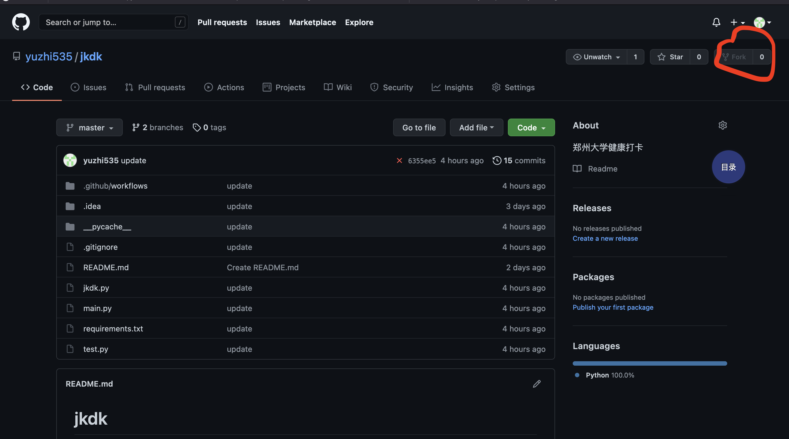
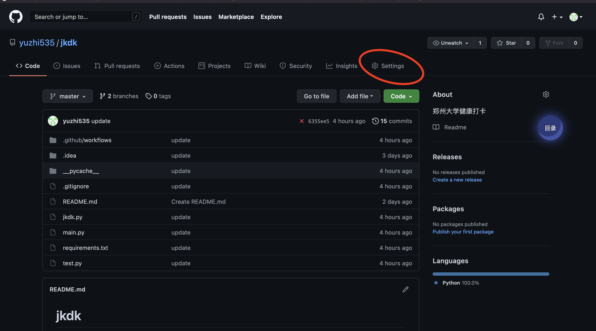
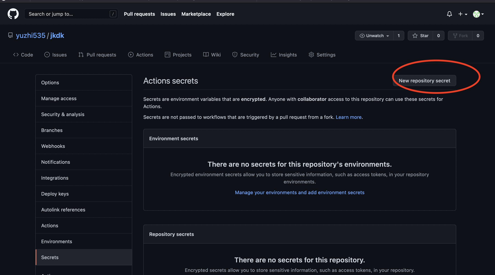
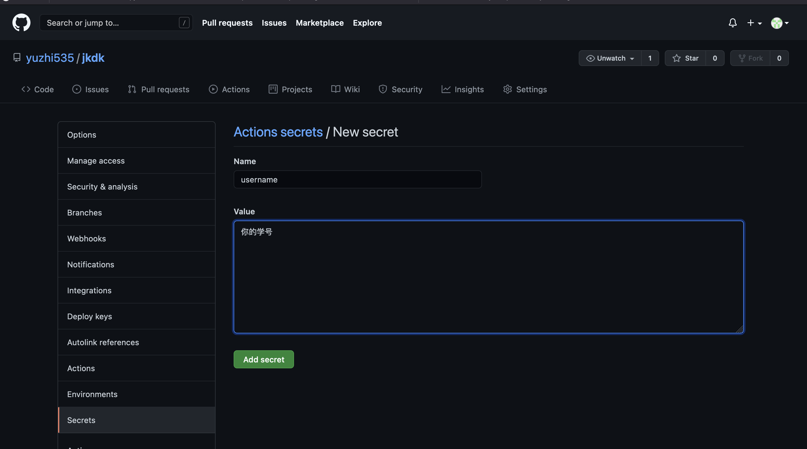

# jkdk

## 郑州大学健康打卡

---

## 使用方法

1. 先把代码整个都clone下来，然后在此基础上自己创建一个github仓库，仓库设置为私人。或者把代码fork到你自己的仓库（不过这样改不了仓库的可见性为私人）

2. 点击settings，找到Secrets

3. 添加2个仓库密钥 username和password，分别表示学号和密码

添加学号，name必须是username
密码的添加同理，但name必须是password

4. 结束。接下来每日6点10分点和7点10分会自动打卡（7点的是防止5点的打卡不成功）

---

## 添加微信通知的方法

1. 注册 https://cp.xuthus.cc/ 这个网站，然后再增强里面，下滑到微信推送，绑定微信账号

2. 把调用代码SKEY保存下来，按照上文添加学号密码的方法，添加到secrets中，其中Name是key，value是你的SKEY

   

3. 按照网站所说，关注微信号，最后成功添加微信通知。
